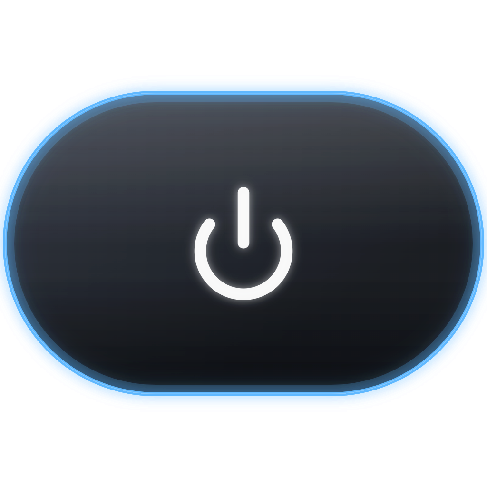
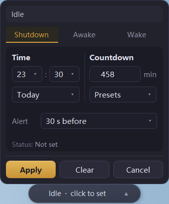
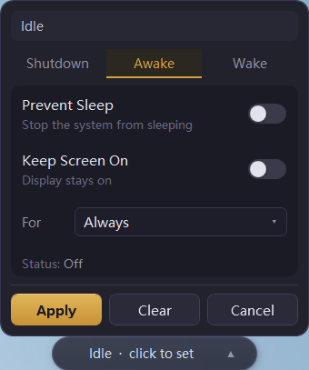
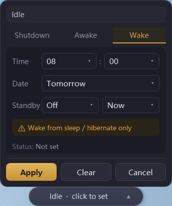

<div align="center">



# PowerCapsule

**A desktop-resident Windows power capsule that handles scheduled shutdown, sleep prevention, and timed wake-up — all from a tiny pill-shaped widget.**

**English** · [中文](README.md)


</div>

---

## Overview

PowerCapsule is a lightweight Windows desktop utility. It is not a bloated power-management suite — it is a small "capsule" that lives on your desktop and lets you handle the most common power actions in one click:

- 🕐 **Scheduled Shutdown** — shut down at a fixed time or after a countdown, with a pre-shutdown reminder and one-click delay
- ☕ **Prevent Sleep** — keep the PC awake during downloads, remote sessions, or long tasks; optionally keep the screen on
- 🌙 **Timed Wake** — wake the PC from sleep / hibernate at a set time
- 💊 **Desktop Capsule** — shows live power status, draggable, auto-collapses to the screen edge
- 📌 **System Tray** — keeps running in the tray after the window is closed; recall it anytime
- 🌐 **Bilingual** — built-in Chinese / English UI (Chinese by default)

> Design principle: lightweight first, few dependencies, small footprint. The release is only ~1MB — no installer, just unzip and run.

---

## Screenshots

Most of the time it is just a small capsule on your desktop showing the current power status; click the arrow on the right to expand the three-tab settings panel.

<div align="center">

| Desktop capsule |
| :---: |
|  |

</div>

| Shutdown | Awake (Prevent Sleep) | Wake |
| :---: | :---: | :---: |
|  |  |  |

**Capsule status priority**: final 60s shutdown countdown > scheduled shutdown > timed wake > prevent sleep > idle.

---

## Features

### 🕐 Scheduled Shutdown
- **Fixed time**: shut down at a chosen time today / tomorrow; if the time has passed, you are prompted to pick tomorrow.
- **Countdown**: 30 min / 1 hour / 2 hour presets, or a custom duration, with the computed shutdown time shown.
- **Pre-shutdown reminder**: a popup appears 60s before by default, with "Cancel shutdown" or "Delay 10 minutes".
- Uses the system command `shutdown /s /t <seconds>`, cancelled via `shutdown /a`.

### ☕ Prevent Sleep
- Prevents the system from sleeping automatically; optionally "Keep screen on".
- Duration: Always / 30 min / 1 hour / custom — automatically turns off when it expires.
- Uses the Win32 API `SetThreadExecutionState` (`ES_SYSTEM_REQUIRED` / `ES_DISPLAY_REQUIRED` / `ES_CONTINUOUS`).
- The sleep-prevention state is released automatically on exit, so it never pollutes the system power policy.

### 🌙 Timed Wake
- Creates a one-time scheduled task (WakeToRun enabled) that wakes the PC from sleep / hibernate at the set time.
- Uses `schtasks` to create a fixed-name wake task that can be cancelled anytime.
- ⚠️ Only wakes from **sleep / hibernate** — it does **not** guarantee powering on after a full shutdown.

### ⚙️ Other
- **System tray**: show / hide the capsule, toggle prevent-sleep, cancel shutdown / wake tasks, exit.
- **Run at startup**: implemented via the registry Run key — no administrator rights required.
- **Persistent config**: all settings and the capsule position are saved to `%AppData%\PowerCapsule\config.json`.

---

## Download & Use

### Option 1: Download the release (recommended)

1. Get `PowerCapsule-v1.0.zip` from [Releases](https://github.com/YoyoDavidGo/PowerCapsule/releases).
2. Unzip anywhere (keep `PowerCapsule.exe` and `Newtonsoft.Json.dll` in the same folder).
3. Double-click `PowerCapsule.exe` — **no installation needed**.

**Requirements**: Windows 10 / 11 with the built-in .NET Framework 4.8 (no extra runtime to install).

### Option 2: Build from source

This is a **.NET Framework 4.8 WPF (WinExe)** project. `dotnet build` cannot compile XAML — use **MSBuild**:

```powershell
& "C:\Program Files (x86)\Microsoft Visual Studio\2022\BuildTools\MSBuild\Current\Bin\MSBuild.exe" `
  "PowerCapsule\PowerCapsule.csproj" /t:Build /p:Configuration=Release
```

Output: `PowerCapsule\bin\Release\PowerCapsule.exe`. The only third-party dependency is Newtonsoft.Json 13.0.3 — run `nuget restore` first if it is missing (or let Visual Studio restore automatically).

---

## Architecture

MVVM + Services, no DI container. Services are created in the `CapsuleWindow` constructor and injected into each ViewModel manually.

```
App.xaml.cs → CapsuleWindow (main floating capsule, 270×42px)
                ├── CapsuleViewModel (1s timer → live status text)
                ├── Popup → DropPanel (three tabs: Shutdown / Awake / Wake)
                │            ├── ShutdownViewModel
                │            ├── SleepPreventViewModel
                │            └── WakeViewModel
                ├── TrayService (system tray icon + context menu)
                └── SettingsView (separate window, opened from the tray)
```

**Core services** (each wraps one Windows OS feature):

| Service | Responsibility | Mechanism |
|---------|----------------|-----------|
| `ShutdownService` | scheduled / countdown shutdown, cancel | `shutdown /s /t` · `shutdown /a` |
| `SleepPreventService` | prevent sleep, keep screen on | `SetThreadExecutionState` (P/Invoke) |
| `WakeTaskService` | timed wake task | `schtasks` (WakeToRun) |
| `ConfigService` | config persistence | Newtonsoft.Json → local JSON |
| `StartupService` | run at startup | registry Run key |
| `TrayService` | system tray | `System.Windows.Forms.NotifyIcon` |

Stack: WPF + C# + .NET Framework 4.8, pure custom WPF styles (no heavy UI library) for a small footprint and fast startup.

---

## Project structure

```
PowerCapsule/
├─ App.xaml(.cs)
├─ Views/        capsule window, drop panel, settings window
├─ ViewModels/   view models per feature
├─ Services/     OS-feature wrapper services
├─ Models/       config & status data models
├─ Utils/        P/Invoke, time, process helpers
└─ Resources/    styles & zh/en string dictionaries
screenshots/     README screenshots
```

---

## Credits & License

Built per a lightweight-first PRD — core principle: lightweight first, few dependencies, small footprint.

For learning and personal use only. Please make sure important work is saved before using actions such as scheduled shutdown.
