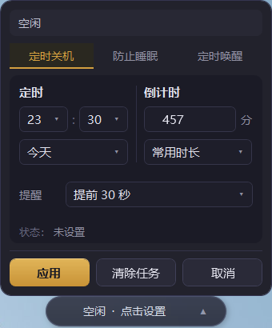
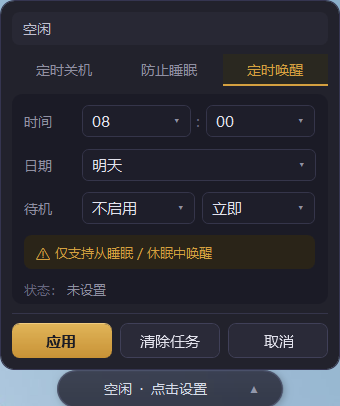

<div align="center">


# PowerCapsule · 电源胶囊

**一个常驻桌面的 Windows 电源胶囊，用最小的界面完成定时关机、防睡眠和睡眠后定时唤醒。**

[English](README.en.md) · **中文**


</div>

---

## 简介

PowerCapsule 是一款轻量级的 Windows 桌面小工具。它不是一个臃肿的电源管理系统，而是一颗常驻桌面的「胶囊」，点一下就能完成日常最常用的电源操作：

- 🕐 **定时关机** —— 固定时间关机 / 倒计时关机，关机前弹窗提醒，可一键延迟
- ☕ **防止睡眠** —— 下载、远程、跑任务时让电脑保持清醒，可选屏幕常亮
- 🌙 **定时唤醒** —— 让电脑在指定时间从睡眠 / 休眠中自动醒来
- 💊 **桌面胶囊** —— 实时显示当前电源状态，可拖动、可靠边自动收起
- 📌 **系统托盘** —— 关闭窗口后退到托盘后台运行，随时唤回
- 🌐 **中英双语** —— 内置中 / 英文界面切换（默认中文）

> 设计原则：轻量优先、少依赖、小体积。发布包仅约 1MB，免安装，解压即用。

---

## 界面预览

平时它只是桌面上一颗小胶囊，实时显示当前电源状态；点击右侧箭头即可展开三标签页设置面板。

<div align="center">

| 桌面胶囊（空闲） |
| :---: |
|  |

</div>

| 定时关机 | 防止睡眠 | 定时唤醒 |
| :---: | :---: | :---: |
|  |  |  |

**胶囊状态显示优先级**：关机最后 60 秒倒计时 > 定时关机 > 定时唤醒 > 防睡眠 > 空闲。

---

## 功能详解

### 🕐 定时关机
- **固定时间**：设定今天 / 明天的某个时间点关机；若时间已过会提示改选明天。
- **倒计时**：30 分钟 / 1 小时 / 2 小时快捷预设，或自定义时长，并显示预计关机时间。
- **关机前提醒**：默认提前 60 秒弹窗，可一键「取消关机」或「延迟 10 分钟」。
- 底层调用系统命令 `shutdown /s /t 秒数`，取消用 `shutdown /a`。

### ☕ 防止睡眠
- 防止系统自动睡眠，可选「保持屏幕常亮」。
- 持续时间支持：一直保持 / 30 分钟 / 1 小时 / 自定义，到期自动关闭。
- 底层调用 Win32 API `SetThreadExecutionState`（`ES_SYSTEM_REQUIRED` / `ES_DISPLAY_REQUIRED` / `ES_CONTINUOUS`）。
- 程序退出时会自动释放防睡眠状态，不会污染系统电源策略。

### 🌙 定时唤醒
- 创建一次性计划任务（启用 WakeToRun），到点把电脑从睡眠 / 休眠中唤醒。
- 底层调用 `schtasks` 创建固定名称的唤醒任务，可随时取消。
- ⚠️ 仅支持从 **睡眠 / 休眠** 中唤醒，**不保证完全关机后自动开机**。

### ⚙️ 其它
- **系统托盘**：显示 / 隐藏胶囊、开关防睡眠、取消关机 / 唤醒任务、退出。
- **开机自启动**：通过注册表 Run 键实现，无需管理员权限。
- **配置持久化**：所有设置与胶囊位置保存到 `%AppData%\PowerCapsule\config.json`。

---

## 下载使用

### 方式一：直接下载发布包（推荐）

1. 前往 [Releases](https://github.com/YoyoDavidGo/PowerCapsule/releases) 下载 `PowerCapsule-v1.0.zip`。
2. 解压到任意目录（请保持 `PowerCapsule.exe` 与 `Newtonsoft.Json.dll` 在同一文件夹）。
3. 双击 `PowerCapsule.exe` 运行，**免安装**。

**运行要求**：Windows 10 / 11，系统自带的 .NET Framework 4.8（无需额外安装运行时）。

### 方式二：从源码构建

本项目是 **.NET Framework 4.8 WPF（WinExe）**，`dotnet build` 无法编译 XAML，请使用 **MSBuild**：

```powershell
& "C:\Program Files (x86)\Microsoft Visual Studio\2022\BuildTools\MSBuild\Current\Bin\MSBuild.exe" `
  "PowerCapsule\PowerCapsule.csproj" /t:Build /p:Configuration=Release
```

输出位于 `PowerCapsule\bin\Release\PowerCapsule.exe`。唯一第三方依赖为 Newtonsoft.Json 13.0.3，首次构建前如缺少依赖请先执行 `nuget restore`（或在 Visual Studio 中自动还原）。

---

## 技术架构

MVVM + Services 分层，无 DI 容器，服务在 `CapsuleWindow` 构造函数中创建并手动注入各 ViewModel。

```
App.xaml.cs → CapsuleWindow（主悬浮胶囊，270×42px）
                ├── CapsuleViewModel（1 秒定时器 → 实时状态文本）
                ├── Popup → DropPanel（三标签页：定时关机 / 防止睡眠 / 定时唤醒）
                │            ├── ShutdownViewModel
                │            ├── SleepPreventViewModel
                │            └── WakeViewModel
                ├── TrayService（系统托盘图标 + 右键菜单）
                └── SettingsView（独立设置窗口，从托盘打开）
```

**核心服务**（每个封装一项 Windows 系统能力）：

| 服务 | 职责 | 实现方式 |
|------|------|----------|
| `ShutdownService` | 定时 / 倒计时关机、取消 | `shutdown /s /t` · `shutdown /a` |
| `SleepPreventService` | 防睡眠、屏幕常亮 | `SetThreadExecutionState`（P/Invoke） |
| `WakeTaskService` | 定时唤醒任务 | `schtasks`（WakeToRun） |
| `ConfigService` | 配置持久化 | Newtonsoft.Json → 本地 JSON |
| `StartupService` | 开机自启动 | 注册表 Run 键 |
| `TrayService` | 系统托盘 | `System.Windows.Forms.NotifyIcon` |

技术栈：WPF + C# + .NET Framework 4.8，纯 WPF 自定义样式（无大型 UI 库），保证小体积与启动速度。

---

## 项目结构

```
PowerCapsule/
├─ App.xaml(.cs)
├─ Views/        胶囊窗口、下拉面板、设置窗口
├─ ViewModels/   各功能的视图模型
├─ Services/     系统能力封装服务
├─ Models/       配置与状态数据模型
├─ Utils/        P/Invoke、时间、进程辅助
└─ Resources/    样式与中英文字符串字典
screenshots/     README 截图
```

---

## 致谢与许可

本项目按「轻量优先版 PRD」开发，核心原则：轻量优先、少依赖、小体积。

仅供学习与个人使用。使用本工具进行定时关机等操作前，请自行确认重要工作已保存。
